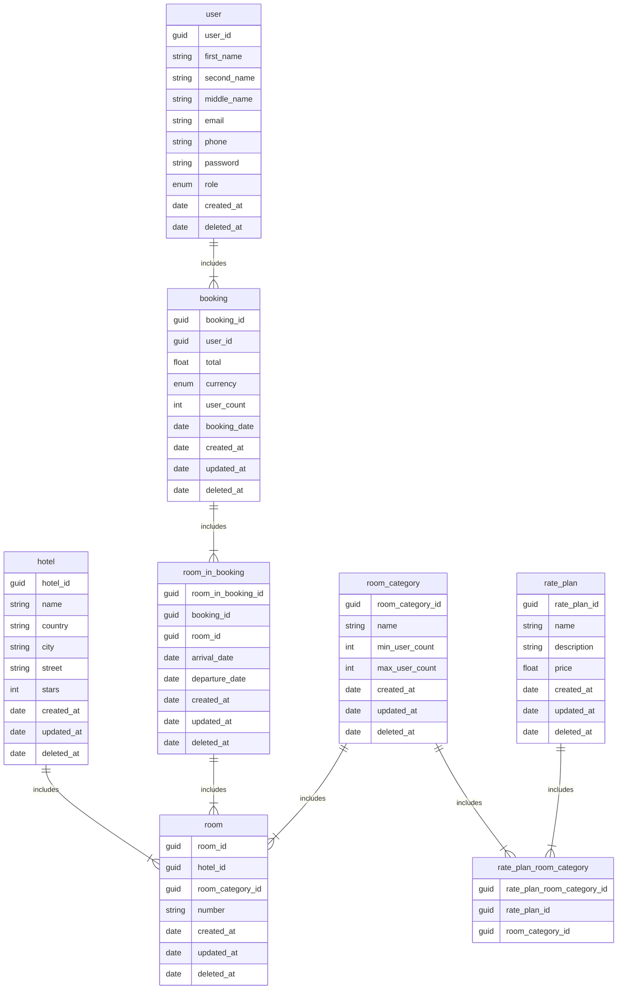

# Курсовая работа: Сервис по бронированию отелей

## Оглавление

1. [Цель и задачи работы](#1-цель-и-задачи-работы)
2. [Предметная область](#2-предметная-область)
3. [Сущности и атрибуты](#3-сущности-и-атрибуты)
4. [ER-диаграмма](#4-er-диаграмма)
5. [Связи между сущностями](#5-связи-между-сущностями)
6. [Функциональные требования](#6-функциональные-требования)
7. [Бизнес-правила](#7-бизнес-правила)
8. [Архитектура и технологии](#8-архитектура-и-технологии)
9. [Ожидаемый результат](#9-ожидаемый-результат)

---

## 1. Цель и задачи работы

**Цель курсовой работы** — разработка информационной системы «Сервис по бронированию отелей», предназначенной для автоматизации процессов управления комплексом гостиниц и предоставления клиентам удобного способа поиска, сравнения и бронирования вариантов размещения.

**Задачи:**

- спроектировать реляционную базу данных, отражающую предметную область «комплекс гостиниц»;
- реализовать CRUD-операции над всеми сущностями системы;
- реализовать бизнес-логику поиска доступных вариантов размещения, создания, просмотра и отмены бронирований;
- реализовать отчёты с агрегацией данных (GROUP BY) для анализа загрузки гостиниц, активности клиентов и структуры бронирований;
- предоставить REST API, документированное через Swagger;
- разработать пользовательский интерфейс для взаимодействия с системой.

---

## 2. Предметная область

Предметная область — **бронирование номеров в сети гостиниц**. Система описывает комплекс гостиниц, каждая из которых имеет набор номеров, отнесённых к определённым категориям (например, «эконом», «люкс»). Для каждой категории номера могут действовать различные тарифные планы, определяющие цену и условия проживания.

Клиенты системы имеют возможность:

- просматривать доступные гостиницы и категории номеров;
- искать варианты размещения по городу, датам, количеству гостей и максимальной цене;
- создавать бронирования с указанием конкретных номеров и периода проживания;
- просматривать свои бронирования;
- отменять бронирования.

Стоимость проживания рассчитывается исходя из цены номера и количества ночей. Номер считается занятым на дату, если эта дата попадает в период между датой заезда и датой выезда (включительно); в дату выезда номер освобождается и доступен для нового заезда.

---

## 3. Сущности и атрибуты

### 3.1. Hotel — Отель

Описывает гостиницу (средство размещения) в комплексе.

| Атрибут | Тип | Описание |
|---|---|---|
| `hotel_id` | guid, PK | Уникальный идентификатор отеля |
| `name` | string | Название отеля |
| `country` | string | Страна расположения |
| `city` | string | Город расположения |
| `street` | string | Улица и адрес |
| `stars` | int | Количество звёзд |
| `created_at` | date | Дата создания записи |
| `updated_at` | date | Дата последнего изменения |
| `deleted_at` | date | Дата удаления (soft-delete) |

### 3.2. RoomCategory — Категория номера

Определяет категорию (тип) номера. Задаёт ограничения по количеству гостей.

| Атрибут | Тип | Описание |
|---|---|---|
| `room_category_id` | guid, PK | Уникальный идентификатор категории |
| `name` | string | Название категории (люкс, эконом и т. д.) |
| `min_user_count` | int | Минимальное количество клиентов |
| `max_user_count` | int | Максимальное количество клиентов |
| `created_at` | date | Дата создания |
| `updated_at` | date | Дата последнего изменения |
| `deleted_at` | date | Дата удаления |

### 3.3. Room — Комната отеля

Физический номер в гостинице, относящийся к определённой категории.

| Атрибут | Тип | Описание |
|---|---|---|
| `room_id` | guid, PK | Уникальный идентификатор комнаты |
| `hotel_id` | guid, FK | Ссылка на отель |
| `room_category_id` | guid, FK | Ссылка на категорию номера |
| `number` | string | Номер комнаты в отеле |
| `created_at` | date | Дата создания |
| `updated_at` | date | Дата последнего изменения |
| `deleted_at` | date | Дата удаления |

### 3.4. User — Пользователь

Пользователь системы, оформляющий бронирования.

| Атрибут | Тип | Описание |
|---|---|---|
| `user_id` | guid, PK | Уникальный идентификатор клиента |
| `first_name` | string | Имя |
| `second_name` | string | Фамилия |
| `middle_name` | string | Отчество |
| `email` | string | Электронная почта |
| `phone` | string | Телефон |
| `password` | string | Пароль |
| `role` | enum | Роль |
| `created_at` | date | Дата регистрации |
| `deleted_at` | date | Дата удаления |

### 3.5. Booking — Бронирование

Факт бронирования клиентом одного или нескольких номеров.

| Атрибут | Тип | Описание |
|---|---|---|
| `booking_id` | guid, PK | Уникальный идентификатор брони |
| `user_id` | guid, FK | Ссылка на клиента |
| `total` | float | Общая стоимость бронирования |
| `currency` | enum | Валюта |
| `user_count` | int | Количество клиентов |
| `booking_date` | date | Дата создания брони |
| `created_at` | date | Дата создания записи |
| `updated_at` | date | Дата последнего изменения |
| `deleted_at` | date | Дата удаления |

### 3.6. RoomInBooking — Комната в бронировании

Связывает бронирование с конкретными номерами и задаёт период проживания для каждого.

| Атрибут | Тип | Описание |
|---|---|---|
| `room_in_booking_id` | guid, PK | Уникальный идентификатор записи |
| `booking_id` | guid, FK | Ссылка на бронирование |
| `room_id` | guid, FK | Ссылка на комнату |
| `arrival_date` | date | Дата заезда |
| `departure_date` | date | Дата выезда |
| `created_at` | date | Дата создания |
| `updated_at` | date | Дата последнего изменения |
| `deleted_at` | date | Дата удаления |

### 3.7. RatePlan — Тарифный план

Описывает условия и цену проживания, которые могут применяться к одной или нескольким категориям номеров.

| Атрибут | Тип | Описание |
|---|---|---|
| `rate_plan_id` | guid, PK | Уникальный идентификатор тарифа |
| `name` | string | Название тарифа |
| `description` | string | Описание условий |
| `price` | float | Цена |
| `created_at` | date | Дата создания |
| `updated_at` | date | Дата последнего изменения |
| `deleted_at` | date | Дата удаления |

### 3.8. RatePlanRoomCategory — Тариф и категория номера

Связующая сущность между тарифным планом и категорией номера (отношение «многие ко многим»).

| Атрибут | Тип | Описание |
|---|---|---|
| `rate_plan_room_category_id` | guid, PK | Уникальный идентификатор связки |
| `rate_plan_id` | guid, FK | Ссылка на тарифный план |
| `room_category_id` | guid, FK | Ссылка на категорию номера |

---

## 4. ER-диаграмма



---

## 5. Связи между сущностями

| Связь | Тип | Описание |
|---|---|---|
| `hotel` → `room` | 1:N | Один отель содержит множество номеров |
| `room_category` → `room` | 1:N | Одна категория относится к множеству номеров |
| `user` → `booking` | 1:N | Один клиент может создать множество броней |
| `booking` → `room_in_booking` | 1:N | Одна бронь может содержать несколько комнат |
| `room` → `room_in_booking` | 1:N | Один номер может участвовать в нескольких бронях (в разные периоды) |
| `rate_plan` ↔ `room_category` | M:N | Через `rate_plan_room_category` — тариф применим к нескольким категориям, категория имеет несколько тарифов |

---

## 6. Функциональные требования

### 6.1. CRUD-операции

Полный набор операций Create / Read / Update / Delete реализуется над всеми сущностями:

- **Hotel** — добавление, просмотр списка и по ID, редактирование, удаление;
- **RoomCategory** — добавление, просмотр, редактирование, удаление;
- **Room** — добавление, просмотр (в том числе по отелю), редактирование, удаление;
- **User** — регистрация, просмотр, редактирование, удаление;
- **Booking** — создание, просмотр, отмена;
- **RoomInBooking** — добавление комнаты в бронь, просмотр, удаление;
- **RatePlan** — добавление, просмотр, редактирование, удаление;
- **RatePlanRoomCategory** — привязка тарифа к категории, отвязка.

### 6.2. Поиск вариантов бронирования

Поиск доступных вариантов выполняется по параметрам:

- **Город (City);**
- **Период дат (ArrivalDate, DepartureDate);**
- **Количество гостей (в пределах min/max категории);**
- **Максимальная цена.**

Результат — список гостиниц и категорий номеров, подходящих под заданные параметры и доступных на указанный период.

### 6.3. Создание бронирования

Выбор Hotel и RoomCategory, указание количества гостей, дат заезда и выезда. Выполняется:

1. проверка доступности номеров на период;
2. расчёт стоимости бронирования (Total) по актуальной цене и числу ночей;
3. создание записи Booking.

### 6.4. Просмотр бронирований

- получение списка всех бронирований с фильтрами: по отелю, по датам, по клиенту и др.;
- получение бронирования по ID.

### 6.5. Отмена бронирования

Найти Booking по ID и отметить его как отменённое.

### 6.6. Отчёты (GROUP BY)

- количество бронирований по отелям;
- суммарная выручка по месяцам;
- средний чек по клиентам;
- топ городов по числу гостей;
- загрузка категорий номеров;
- самые популярные тарифные планы.

---

## 7. Бизнес-правила

1. **Расчёт стоимости.** Общая стоимость бронирования рассчитывается как количество дней, умноженное на цену комнаты за одни сутки.

2. **Проверка занятости.** Номер считается занятым на дату *X*, если день *X* является датой заезда или находится между датой заезда и выезда. **В дату выезда номер освобождается и доступен для заезда.**

3. **Согласованность брони.** Комнаты, добавляемые в бронь, должны относиться к тому же отелю, что указан в бронировании.

4. **Соответствие количества гостей.** Количество гостей в бронировании должно укладываться в диапазон `min_user_count..max_user_count` категории номера.

5. **Soft-delete.** Удаление сущностей выполняется логически — простановкой поля `deleted_at`; физически записи не удаляются.

6. **Аудит.** Для всех изменяемых сущностей ведутся поля `created_at` и `updated_at`.

---

## 8. Архитектура и технологии

- **Платформа:** ASP.NET Core WebApi (.NET 10)
- **СУБД:** Microsoft SQL Server
- **ORM:** Entity Framework Core
- **Архитектура:** многослойная (Domain, Application, Infrastructure, WebApi)
- **Паттерны:** Repository, DI
- **Документация API:** Swagger / Swashbuckle
- **Миграции:** EF Core Migrations

### Структура решения

```
backend/
├── Domain/          # сущности, интерфейсы репозиториев, доменные исключения
├── Application/     # DTO, сервисы бизнес-логики
├── Infrastructure/  # DbContext, конфигурации EF, репозитории, миграции
└── WebApi2/         # контроллеры, exception handlers, DI, Swagger
```

```
frontend/
*в разработке*
```

---

## 9. Ожидаемый результат

В результате выполнения курсовой работы должен быть получен структурированный проект, включающий:

- **реляционную базу данных** из восьми взаимосвязанных таблиц (`hotel`, `room_category`, `room`, `user`, `booking`, `room_in_booking`, `rate_plan`, `rate_plan_room_category`), обеспечивающих целостность данных и поддержку всех операций предметной области;
- **CRUD-операции** над всеми сущностями;
- **бизнес-логику** поиска вариантов размещения, создания, просмотра и отмены бронирований с учётом правил доступности и расчёта стоимости;
- **отчёты с группировкой (GROUP BY)** для анализа загрузки гостиниц, активности клиентов и структуры бронирований;
- **REST API**, документированное через Swagger UI;
- **пользовательский интерфейс** для взаимодействия с системой.

Проект должен быть реализован с соблюдением принципов REST, внедрения зависимостей (DI) и паттерна Repository, а также обладать свойством расширяемости и тестируемости.
